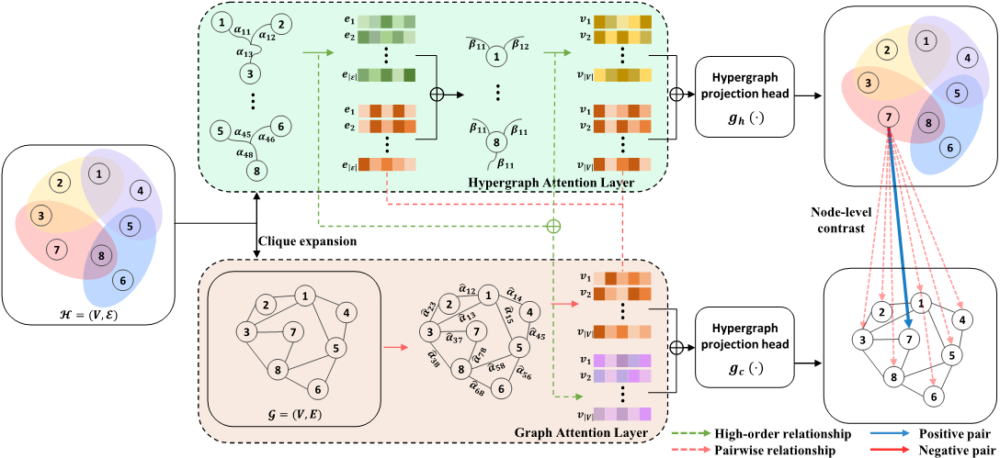

# Multi-view Mixed Attention for Contrastive Learning on Hypergraphs
Our implementation of MMACL [Multi-view Mixed Attention for Contrastive Learning on Hypergraphs](), by Jongsoo Lee presented at [SIGIR 2024.](https://sigir-2024.github.io/)

In this paper, we propose Multi-view Mixed Attention for Contrastive Learning (**MMACL**) to address the aforementioned 
problem. MMACL proposes Mixed-Attention, which blends high-order relationships derived from the hypergraph attention network 
and pairwise relationships derived from the graph attention net-work. Then, it performs node-level contrastive learning to the graph structure with different views learned at each layer to finally obtain an expressive node representation. 

# Reference
@inproceedings{10.1145/3626772.3657897,
author = {Lee, Jongsoo and Chae, Dong-Kyu},
title = {Multi-view Mixed Attention for Contrastive Learning on Hypergraphs},
year = {2024},
booktitle = {Proceedings of the 47th International ACM SIGIR Conference on Research and Development in Information Retrieval},
pages = {2543–2547},
numpages = {5},
location = {Washington DC, USA},
series = {SIGIR '24}
}

# Dependencies
- CPU or NVIDIA GPU
- Python 3.11.8
- pytorch 2.0.1 
- numpy 1.26.4
- torch-geometric=2.5.2
- pyyaml=6.0.1

# Training
In order to train a MMACL, use main.py script.
For example, to train our model, use the following: 
<pre><code>
python train.py --dataset citeseer
</code></pre>

